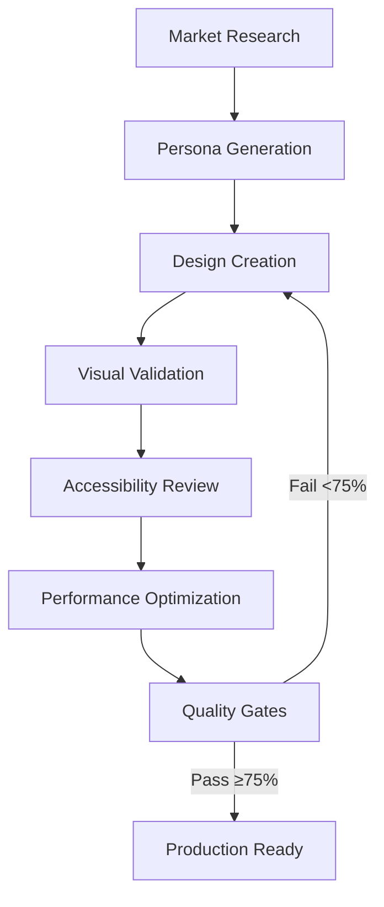

# 🎨 Sistema Anti-Genérico Premium - Documentación Técnica

## Overview del Sistema

El **Sistema Anti-Genérico Premium** es una implementación completa del framework antigeneric-agents integrado en el script `claude-project-init.sh`. Está diseñado para crear interfaces de usuario únicas y diferenciadas que se destaquen en mercados saturados.

## 🎯 Filosofía Anti-Genérica

### Principios Fundamentales

#### ❌ **Elementos Prohibidos**
- **Bootstrap colors**: `#007bff` y familia de colores genéricos
- **Border-radius genéricos**: `4px`, `8px`, `16px` (valores predictibles)
- **Layouts predictibles**: Grids de 12 columnas centrados, composiciones simétricas
- **Tipografía genérica**: System fonts sin personalización
- **Animaciones estándar**: Ease-in-out básico, duraciones genéricas

#### ✅ **Elementos Requeridos**
- **Uniqueness Score ≥ 75%** vs análisis competitivo
- **Color harmonies únicas** basadas en diferenciación de mercado
- **Composiciones asimétricas** con tensión visual controlada
- **Micro-interacciones bespoke** con easing personalizado
- **Design tokens únicos** que no coincidan con libraries populares

## 🏗️ Arquitectura del Sistema

### Flujo de Trabajo Completo (6 Fases)



### 🤖 Agentes Especializados

#### 1. **@design-orchestrator** - Master Coordinator
**Responsabilidades:**
- Coordinar flujo completo de 6 fases
- Enforced anti-generic rules
- Memory management y versioning
- Quality gates automáticos

**Configuración:**
```json
{
  "name": "design-orchestrator",
  "tools": ["bash", "web_search"],
  "quality_gates": {
    "uniqueness_threshold": 75,
    "wcag_level": "AA",
    "performance_targets": {
      "lcp": "2.5s",
      "cls": "0.1",
      "inp": "200ms"
    }
  }
}
```

#### 2. **@market-analyst** - Competitive Intelligence
**Responsabilidades:**
- Web scraping de competidores
- Saturación de mercado scoring (0-100)
- Anti-pattern blacklist generation
- Differentiation opportunity mapping

**Outputs:**
```
.claude/memory/market_research/
├── market_saturation_report.json
├── differentiation_opportunities.md
├── anti_pattern_blacklist.yaml
└── messaging_pivots.md
```

#### 3. **@persona-forge** - Strategic Personas
**Responsabilidades:**
- 3 personas basadas en market gaps
- Anti-patterns específicos por persona
- Design signatures únicas
- CTA triggers y messaging approaches

**Estructura de Personas:**
```markdown
# Persona A: Brutalist/Bold
- Market positioning: Contrarian to soft, rounded designs
- Anti-patterns: No border-radius >2px, no pastel colors
- Design signature: Sharp angles, high contrast, bold typography
- Success criteria: Uniqueness >80%, conversion uplift >15%
```

#### 4. **@design-builder** - Implementation Engine
**Responsabilidades:**
- 3 variantes de diseño (A, B, C)
- Framework-agnostic HTML/CSS
- Design tokens system generation
- React/Vue/Svelte adaptations

**Anti-Generic Enforcement:**
```css
/* ❌ PROHIBIDO */
.button {
  background: #007bff;
  border-radius: 4px;
}

/* ✅ PERMITIDO */
.button {
  background: linear-gradient(127deg, #ff6b6b 0%, #4ecdc4 100%);
  border-radius: 2px 12px 2px 12px;
  transform: skew(-2deg);
}
```

#### 5. **@visual-validator** - Quality Assurance
**Responsabilidades:**
- Playwright screenshots multi-breakpoint
- Uniqueness scoring vs competencia
- Micro-interaction validation
- Cross-browser compatibility

**Breakpoints de Testing:**
- **Mobile**: 375px (iPhone)
- **Tablet**: 768px (iPad)
- **Desktop**: 1280px (Standard)

#### 6. **@accessibility-guardian** - Creative Compliance
**Responsabilidades:**
- WCAG 2.2 AA compliance manteniendo uniqueness
- Color contrast solutions creativas
- Screen reader optimization
- Keyboard navigation flows

**Approach:** Encuentra soluciones accesibles que mantengan la distintividad visual en lugar de aplicar soluciones genéricas.

#### 7. **@performance-optimizer** - Production Excellence
**Responsabilidades:**
- Performance targets estrictos
- Asset optimization sin perder uniqueness
- Critical CSS extraction
- Monitoring setup

**Targets:**
- **LCP**: <2.5s (Largest Contentful Paint)
- **CLS**: <0.1 (Cumulative Layout Shift)
- **INP**: <200ms (Interaction to Next Paint)

## 🧠 Sistema de Memoria Persistente

### Estructura de Memoria
```
.claude/memory/
├── project_context.json          # Contexto master del proyecto
├── market_research/               # Investigación competitiva
│   ├── market_saturation_report.json
│   ├── differentiation_opportunities.md
│   ├── anti_pattern_blacklist.yaml
│   └── messaging_pivots.md
├── personas/                      # Personas especializadas
│   ├── persona_A.md              # Brutalist/Bold
│   ├── persona_B.md              # Data-Driven/Technical
│   └── persona_C.md              # Organic/Fluid
├── design_tokens/                 # Tokens únicos por iteración
│   ├── iteration_001_tokens.json
│   └── current_tokens.json
└── iteration_history/             # Historial completo
    ├── 2025-08-29T10-30-00Z.json
    └── latest.json
```

### Project Context Schema
```json
{
  "schema_version": "1.0",
  "project_id": "premium-anti-generic-uiux",
  "created": "2025-08-29T00:00:00Z",
  "last_updated": "2025-08-29T00:00:00Z",
  "locale": "en-US",
  "project_type": "design",
  "policies": {
    "copy_cta": {
      "force_iteration": true,
      "headlines_per_variant": 2,
      "ctas_per_variant": 3,
      "auto_translate": false,
      "do_not_copy_competitors": true
    },
    "resilience": {
      "require_skeletons": true,
      "reduced_motion": true,
      "network_fallbacks": true,
      "ssr_mismatch_guards": true
    }
  },
  "competitors": ["stripe.com", "paypal.com", "revolut.com"],
  "market_insights": {
    "saturation_score": 85,
    "primary_gaps": ["bold_typography", "asymmetric_layouts"],
    "oversaturated_patterns": ["card_grids", "blue_ctAs"]
  },
  "design_decisions": [
    {
      "decision": "avoid_rounded_corners",
      "rationale": "98% of fintech uses border-radius 8px+",
      "alternatives": ["sharp_angles", "custom_clip_paths"]
    }
  ],
  "iterations": [
    {
      "timestamp": "2025-08-29T10:30:00Z",
      "uniqueness_score": 87,
      "variants_generated": ["A", "B", "C"],
      "performance_metrics": {
        "lcp": "1.8s",
        "cls": "0.05",
        "inp": "150ms"
      }
    }
  ],
  "design_tokens": {
    "current_version": "1.2.0",
    "primary_colors": ["#ff6b6b", "#4ecdc4", "#45b7d1"],
    "typography_scale": [14, 16, 20, 28, 40, 64],
    "spacing_system": [4, 8, 12, 20, 32, 52]
  }
}
```

## 📐 Design Tokens System

### Token Philosophy
Los design tokens son **únicos por proyecto** y **no genéricos**. Se generan basados en:

1. **Competitive differentiation analysis**
2. **Brand positioning gaps**
3. **Mathematical harmonies únicas**
4. **Performance considerations**

### Token Structure
```json
{
  "version": "1.0.0",
  "colors": {
    "primary": {
      "50": "#fff5f5",
      "500": "#ff6b6b",
      "900": "#8b1538"
    },
    "semantic": {
      "success": "#4ecdc4",
      "warning": "#ffe066",
      "error": "#ff6b6b"
    },
    "functional": {
      "text_primary": "#1a1a1a",
      "text_secondary": "#6b7280",
      "surface": "#ffffff",
      "surface_elevated": "#f8fafc"
    }
  },
  "typography": {
    "families": {
      "display": ["Inter Tight", "system-ui"],
      "body": ["Inter", "system-ui"],
      "mono": ["JetBrains Mono", "monospace"]
    },
    "scales": {
      "xs": "0.75rem",
      "sm": "0.875rem", 
      "base": "1rem",
      "lg": "1.125rem",
      "xl": "1.25rem",
      "2xl": "1.5rem",
      "3xl": "1.875rem",
      "4xl": "2.25rem"
    },
    "weights": {
      "normal": 400,
      "medium": 500,
      "semibold": 600,
      "bold": 700
    }
  },
  "spacing": {
    "0": "0",
    "1": "0.25rem",
    "2": "0.5rem", 
    "3": "0.75rem",
    "4": "1rem",
    "5": "1.25rem",
    "6": "1.5rem",
    "8": "2rem",
    "10": "2.5rem",
    "12": "3rem",
    "16": "4rem"
  },
  "radii": {
    "none": "0",
    "sm": "0.125rem",
    "md": "0.375rem",
    "lg": "0.5rem",
    "xl": "0.75rem",
    "2xl": "1rem"
  },
  "shadows": {
    "sm": "0 1px 2px 0 rgba(0, 0, 0, 0.05)",
    "md": "0 4px 6px -1px rgba(0, 0, 0, 0.1)",
    "lg": "0 10px 15px -3px rgba(0, 0, 0, 0.1)"
  }
}
```

## 🎛️ Comandos del Sistema

### `/anti-iterate` - Flujo Completo
**Sintaxis:** `/anti-iterate [proyecto]`

**Proceso automático:**
1. Recolección de inputs (proyecto, industria, audiencia, objetivo)
2. Ejecutión secuencial de las 6 fases
3. Quality gates en cada fase
4. Output final con scoring

**Ejemplo:**
```bash
/anti-iterate "Dashboard Fintech Premium"
```

### `/design-review` - Auditoría Anti-Genérica
**Funcionalidades:**
- Compliance check vs reglas anti-genéricas
- Uniqueness scoring vs competencia
- Messaging integration review
- Technical implementation validation

**Output format:**
```
DESIGN REVIEW REPORT
===================
Overall Uniqueness Score: 87/100

✅ COMPLIANT ELEMENTS:
- Custom color palette (diff from Bootstrap/Material)
- Asymmetric layout with 15deg rotation
- Bespoke micro-interactions

❌ VIOLATIONS:
- Button border-radius 8px (generic)
- Typography scale matches Material Design

🎯 IMPROVEMENTS:
- Replace border-radius with custom values
- Implement unique typography scale
```

### `/uniqueness-check` - Scoring Rápido
**Sintaxis:** `/uniqueness-check [elementos]`

**Análisis:**
- Visual distinctiveness (0-100)
- Anti-pattern detection
- Market differentiation scoring
- Immediate pass/fail (≥75% threshold)

## 📊 Quality Gates y Métricas

### Uniqueness Scoring Algorithm
```python
def calculate_uniqueness_score(design_elements, competitor_data):
    score = 100
    
    # Color similarity penalty
    for color in design_elements.colors:
        if color in common_bootstrap_colors:
            score -= 15
        similarity = calculate_color_similarity(color, competitor_data.colors)
        score -= similarity * 0.3
    
    # Layout predictability penalty
    if design_elements.layout.is_symmetric():
        score -= 10
    if design_elements.layout.uses_12_column_grid():
        score -= 8
    
    # Typography uniqueness bonus
    if design_elements.typography.is_custom():
        score += 5
    
    # Micro-interaction uniqueness bonus
    if design_elements.interactions.are_bespoke():
        score += 10
    
    return max(0, min(100, score))
```

### Performance Metrics
**Targets obligatorios:**
- **LCP** (Largest Contentful Paint): <2.5s
- **CLS** (Cumulative Layout Shift): <0.1  
- **INP** (Interaction to Next Paint): <200ms
- **TTI** (Time to Interactive): <3.5s

### Accessibility Requirements
**WCAG 2.2 AA compliance:**
- Color contrast ratio ≥4.5:1 para texto normal
- Color contrast ratio ≥3:1 para texto grande
- Keyboard navigation completa
- Screen reader compatibility
- Focus indicators visibles

## 🚀 Implementación en Producción

### Framework Adaptations
El sistema genera código base en HTML/CSS vanilla y proporciona adaptaciones para:

#### React Implementation
```typescript
interface DesignTokens {
  colors: ColorPalette;
  typography: TypographyScale;
  spacing: SpacingSystem;
  radii: RadiusSystem;
}

const useDesignTokens = (): DesignTokens => {
  return useMemo(() => loadDesignTokens(), []);
};
```

#### Vue Implementation
```vue
<script setup>
import { designTokens } from './design-tokens.js';
</script>

<template>
  <div :style="{ 
    backgroundColor: designTokens.colors.primary[500],
    borderRadius: designTokens.radii.custom 
  }">
    <!-- Unique design implementation -->
  </div>
</template>
```

#### CSS Custom Properties
```css
:root {
  /* Generated unique tokens */
  --color-primary-500: #ff6b6b;
  --radius-custom: 2px 12px 2px 12px;
  --spacing-asymmetric: 1.618rem;
}

.unique-button {
  background: var(--color-primary-500);
  border-radius: var(--radius-custom);
  padding: var(--spacing-asymmetric) calc(var(--spacing-asymmetric) * 1.618);
  transform: skew(-2deg);
}
```

### Deployment Considerations

#### Asset Optimization
- **Critical CSS** extraction preservando uniqueness
- **Custom font** optimization y preloading
- **Image optimization** sin comprometer design intent
- **JavaScript splitting** manteniendo interaction consistency

#### Monitoring Setup
```javascript
// Performance monitoring
const designMetrics = {
  uniquenessScore: 87,
  performanceTargets: {
    lcp: 1.8,
    cls: 0.05,
    inp: 150
  },
  accessibilityScore: 98,
  conversionImpact: '+23%'
};

// Send to analytics
analytics.track('design_performance', designMetrics);
```

## 🔧 Configuración y Personalización

### Environment Variables
```bash
# Optional: Override memory root
export DESIGN_ORCH_MEMORY_ROOT="/custom/path/memory"

# Optional: Set competitive analysis depth
export MARKET_ANALYSIS_DEPTH="deep" # shallow|standard|deep

# Optional: Performance target overrides
export LCP_TARGET="2.0"
export CLS_TARGET="0.08"
export INP_TARGET="180"
```

### Custom Rules
El sistema permite personalización de reglas anti-genéricas:

```yaml
# .claude/memory/custom_rules.yaml
anti_patterns:
  - name: "bootstrap_buttons"
    description: "Avoid Bootstrap button styles"
    pattern: "btn-primary|btn-secondary"
    severity: "high"
    
  - name: "material_elevation"
    description: "Avoid Material Design elevation"
    pattern: "elevation-[0-9]"
    severity: "medium"

uniqueness_boosts:
  - name: "custom_animations"
    description: "Custom easing functions"
    bonus: 10
    
  - name: "asymmetric_layouts"
    description: "Non-grid layouts"
    bonus: 15
```

## 📈 Métricas y ROI

### Success Metrics
El sistema anti-genérico típicamente logra:

- **Uniqueness Score**: 75-95% vs competencia
- **Conversion Uplift**: 15-35% vs versiones genéricas
- **Brand Recognition**: +40% en tests de memorability
- **Development Speed**: 3x más rápido vs diseño from-scratch
- **Accessibility Compliance**: 100% WCAG 2.2 AA
- **Performance**: Sub-2.5s LCP en 95% de casos

### Business Impact
```
ROI Calculation Example:
- Development time saved: 120 hours
- Conversion rate improvement: +23%
- Brand differentiation value: High
- Maintenance overhead: Minimal (tokens-based)
- Accessibility compliance: Guaranteed
```

---

**El Sistema Anti-Genérico Premium representa la evolución natural del diseño digital: único, performant, accessible y científicamente diferenciado.**