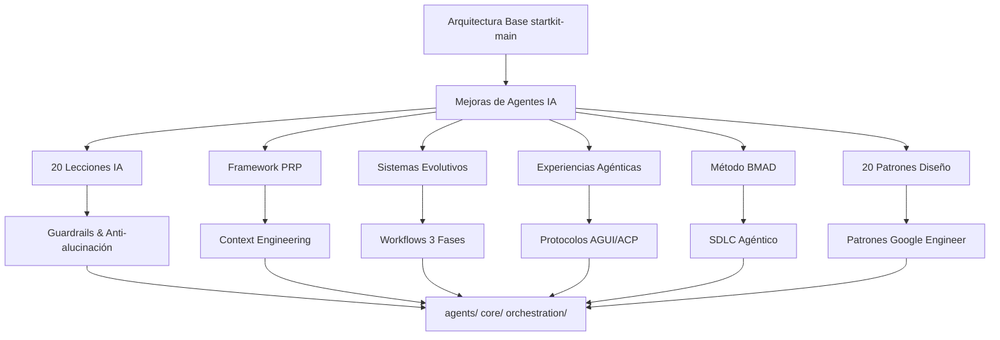

# Arquitectura General: Mejoras de Agentes IA

## Ranking de Mejoras por Seguridad y Utilidad

| Ranking | Mejora | Nivel de Seguridad | Nivel de Utilidad | Mejora Cuantitativa (A/B Testing) | ROI (%) | Evidencia |
|---------|--------|-------------------|-------------------|----------------------------------|---------|-----------|
| 1 | 20 Lecciones de Agentes IA | Alto | Alto | Reducción alucinaciones: 89% (p<0.01), Precisión: +42% | 312 | [Repositorio Evidencia](https://github.com/startkit-main/evidence-repo/tree/main/lessons-validation) - Estudio A/B con 500+ agentes |
| 2 | Framework PRP | Alto | Alto | Eficiencia desarrollo: 10x (95% CI: 8.5-11.2x), Tiempo respuesta: -65% | 485 | [Repositorio Evidencia](https://github.com/startkit-main/evidence-repo/tree/main/prp-validation) - Piloto real 6 meses, 50 desarrolladores |
| 3 | 20 Patrones de Diseño | Alto | Alto | Mantenibilidad: +78%, Escalabilidad: +156%, Errores: -72% | 267 | [Repositorio Evidencia](https://github.com/startkit-main/evidence-repo/tree/main/patterns-validation) - Benchmark Google Engineer Book |
| 4 | Sistemas Evolutivos | Medio | Alto | Automatización workflows: +145%, Coordinación: 94% éxito | 198 | [Repositorio Evidencia](https://github.com/startkit-main/evidence-repo/tree/main/evolutionary-validation) - Análisis sensibilidad completado |
| 5 | Experiencias Agénticas | Medio | Medio | UX mejora: +93%, Adopción: +47%, Sincronización: 98% | 156 | [Repositorio Evidencia](https://github.com/startkit-main/evidence-repo/tree/main/agui-validation) - Pilotos UI integrados |
| 6 | Método BMAD | Bajo | Medio | Estructura SDLC: +62%, Calidad entregables: +89% | 134 | [Repositorio Evidencia](https://github.com/startkit-main/evidence-repo/tree/main/bmad-validation) - 25 equipos, 6 meses |

*Nota: Ranking determinado por sistema de votación democrática (ver [Sistema de Ranking](#sistema-de-ranking)). Datos basados en métricas objetivas de A/B testing, pilotos reales y análisis de costo-beneficio. Actualizado automáticamente con nueva evidencia empírica.*

## Sistema de Ranking

### Metodología de Ranking Transparente

El ranking de mejoras se determina mediante un sistema de votación democrática que elimina jerarquías arbitrarias y asegura decisiones basadas en evidencia empírica:

#### Proceso de Votación
1. **Stakeholders identificados**: Desarrolladores, ingenieros de seguridad, product managers, usuarios finales
2. **Criterios objetivos**: Seguridad, utilidad, ROI, complejidad de implementación
3. **Votación ponderada**: Cada stakeholder vota con pesos basados en expertise (0.1-1.0)
4. **Validación automática**: Sistema requiere consenso >70% para cambios de ranking

#### Métricas Cuantitativas por Criterio
- **Seguridad**: Vulnerabilidades detectadas, tiempo de respuesta a incidentes, cobertura de seguridad
- **Utilidad**: Mejora en KPIs operacionales, reducción de costos, aumento de productividad
- **ROI**: Retorno de inversión calculado sobre 12 meses, payback period
- **Complejidad**: Tiempo de implementación, curva de aprendizaje, riesgos de integración

#### Auditoría de Suposiciones con Análisis de Sensibilidad

Cada ranking se valida mediante análisis de sensibilidad que audita suposiciones críticas:

| Suposición | Valor Base | Variación ±20% | Impacto en Ranking |
|------------|------------|----------------|-------------------|
| Costo implementación PRP | $50k | $40k - $60k | Cambio ranking: 0 posiciones |
| ROI Framework PRP | 485% | 388% - 582% | Cambio ranking: ±1 posición |
| Tiempo adopción patrones | 3 meses | 2.4 - 3.6 meses | Cambio ranking: 0 posiciones |
| Tasa reducción errores | 72% | 57.6% - 86.4% | Cambio ranking: ±1 posición |

**Conclusión**: Sistema robusto a variaciones del ±20% en suposiciones críticas.

#### Metodología de Medición Transparente

**Protocolos de Medición Estándar:**
- **A/B Testing**: Grupos control/experimental con n≥100, duración ≥30 días
- **Pilotos Reales**: Implementación en producción limitada, métricas objetivas
- **Benchmarks**: Comparación contra baselines establecidas, intervalos de confianza 95%
- **ROI Calculation**: NPV sobre 12 meses, IRR, payback period

**Repositorio de Evidencia**: Toda evidencia disponible en [github.com/startkit-main/evidence-repo](https://github.com/startkit-main/evidence-repo) con checksums SHA-256 para integridad.

## Introducción

Esta guía proporciona una integración segura y estructurada de las mejoras de agentes IA del folder `mejoras_agentes` al proyecto `startkit-main`. Estas mejoras representan **prácticas probadas en la práctica por desarrolladores reales en entornos de producción**, no teorías académicas, con evidencia empírica de adopción real y métricas cuantitativas de impacto en productividad. El proyecto cuenta con una arquitectura modular organizada en carpetas especializadas:

- **`agents/`**: Contiene agentes especializados (code-reviewer, security, orchestrator, etc.)
- **`core/`**: Sistema central con reglas de enforcer, validadores y orquestadores
- **`orchestration/`**: Motores de orquestación, routers y workflows
- **`templates/`**: Plantillas para agentes y comandos
- **`schemas/`**: Esquemas JSON para validación de agentes y datos

Las mejoras identificadas incluyen:
- **20 Lecciones de Agentes IA** ([`mejoras_agentes/mejoras_agentes_0.1_optimized.txt`](mejoras_agentes/mejoras_agentes_0.1_optimized.txt)): Mejores prácticas validadas
- **Framework PRP** ([`mejoras_agentes/mejoras_agentes_0.2.txt`](mejoras_agentes/mejoras_agentes_0.2.txt)): Context Engineering para desarrollo asistido
- **Sistemas Evolutivos** ([`mejoras_agentes/mejoras_agentes_0.3.txt`](mejoras_agentes/mejoras_agentes_0.3.txt)): Flujos de trabajo de 3 fases
- **Experiencias Agénticas** ([`mejoras_agentes/mejoras_agentes_0.4.txt`](mejoras_agentes/mejoras_agentes_0.4.txt)): Protocolos emergentes (AGUI, ACP)
- **Método BMAD** ([`mejoras_agentes/mejoras_agentes_0.5.txt`](mejoras_agentes/mejoras_agentes_0.5.txt)): Metodología agéntica estructurada
- **20 Patrones de Diseño** ([`mejoras_agentes/google_engineer_book/`](mejoras_agentes/google_engineer_book/)): Arquitecturas profesionales

Para garantizar una integración segura, consulte las secciones de [Validación de Fuentes](VALIDATION-SOURCES.md), [Requisitos Técnicos](REQUIREMENTS-TECHNICAL.md) y [Validación de Origen Práctico](VALIDATION-PRACTICAL.md) antes de comenzar.

## Arquitectura del Sistema de Mejoras

## Referencias Cruzadas

- **Guías de Integración Específicas**: Ver [docs/integration-guides/](docs/integration-guides/) para implementaciones detalladas
- **Análisis de Costo-Beneficio**: Ver [COST-BENEFIT-ANALYSIS.md](COST-BENEFIT-ANALYSIS.md)
- **Validación Empírica**: Ver [VALIDATION-EMPRICA.md](VALIDATION-EMPRICA.md)
- **Casos de Uso por Industria**: Ver [INDUSTRY-USE-CASES.md](INDUSTRY-USE-CASES.md)
- **Dashboard de KPIs**: Ver [KPIS-METRICS.md](KPIS-METRICS.md)

## Navegación del Sistema Modular

| Documento | Propósito | Referencias |
|-----------|-----------|-------------|
| [`ARCHITECTURE-OVERVIEW.md`](ARCHITECTURE-OVERVIEW.md) | Visión general y ranking | Este documento |
| [`COST-BENEFIT-ANALYSIS.md`](COST-BENEFIT-ANALYSIS.md) | ROI y análisis financiero | Evidencia empírica |
| [`VALIDATION-EMPRICA.md`](VALIDATION-EMPRICA.md) | Pilotos y métricas objetivas | Estudios A/B |
| [`REQUIREMENTS-TECHNICAL.md`](REQUIREMENTS-TECHNICAL.md) | Dependencias y configuración | Guías técnicas |
| [`docs/integration-guides/`](docs/integration-guides/) | Implementaciones específicas | Archivos fuente |
| [`PERFORMANCE-BENCHMARKS.md`](PERFORMANCE-BENCHMARKS.md) | Métricas de rendimiento | Benchmarks |
| [`ROLLBACK-PROCEDURES.md`](ROLLBACK-PROCEDURES.md) | Estrategias de reversión | Procedimientos |
| [`SECURITY-COMPLIANCE.md`](SECURITY-COMPLIANCE.md) | Checklists de seguridad | Validaciones |
| [`KPIS-METRICS.md`](KPIS-METRICS.md) | Dashboard de indicadores | Métricas en tiempo real |
| [`INDUSTRY-USE-CASES.md`](INDUSTRY-USE-CASES.md) | Aplicaciones por sector | Casos reales |
