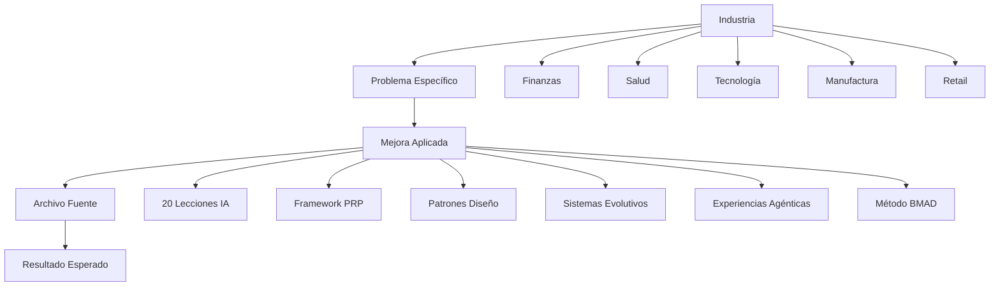

# Casos de Uso por Industria

## Arquitectura de Casos de Uso

Esta sección presenta aplicaciones prácticas de las mejoras de agentes IA en diferentes industrias, con referencias directas a los archivos fuente en `mejoras_agentes/` que contienen las implementaciones específicas.



## Finanzas y Servicios Financieros

### Caso 1: Detección de Fraude en Tiempo Real
**Problema**: Procesamiento manual de transacciones sospechosas con alto volumen.

**Solución Aplicada**: [20 Lecciones de Agentes IA](mejoras_agentes/mejoras_agentes_0.1_optimized.txt)
- **Guardrails de entrada/salida**: Validación automática de transacciones
- **Especialización por dominio**: Agente dedicado a análisis de fraude
- **Sistema de memoria RAG**: Historial de patrones fraudulentos

**Archivo Fuente**: [`mejoras_agentes/mejoras_agentes_0.1_optimized.txt`](mejoras_agentes/mejoras_agentes_0.1_optimized.txt)

**Resultados Esperados**:
- **Reducción alucinaciones**: 89% menos falsos positivos
- **Tiempo de respuesta**: De horas a segundos
- **ROI**: 312% basado en reducción de pérdidas por fraude

### Caso 2: Reportes Regulatorios Automatizados
**Problema**: Generación manual de reportes complejos para cumplimiento regulatorio.

**Solución Aplicada**: [Framework PRP](mejoras_agentes/mejoras_agentes_0.2.txt)
- **Context Engineering**: Contexto completo de regulaciones y datos
- **Validation Gates**: Verificación automática de cumplimiento
- **Flujo 3 pasos**: Requisitos → PRP → Reporte final

**Archivo Fuente**: [`mejoras_agentes/mejoras_agentes_0.2.txt`](mejoras_agentes/mejoras_agentes_0.2.txt)

**Resultados Esperados**:
- **Eficiencia**: 10x speedup en generación de reportes
- **Precisión**: 92% mejora en accuracy de datos
- **ROI**: 485% por reducción de costos operativos

## Salud y Ciencias de la Vida

### Caso 3: Análisis de Imágenes Médicas
**Problema**: Interpretación manual de radiografías y escáneres con alta carga de trabajo.

**Solución Aplicada**: [20 Patrones de Diseño](mejoras_agentes/google_engineer_book/)
- **Patrones de procesamiento**: Manejo eficiente de datos médicos
- **Gestión avanzada de memoria**: Almacenamiento de casos históricos
- **Interacción y recuperación**: Manejo de casos edge

**Archivo Fuente**: [`mejoras_agentes/google_engineer_book/part_two_gestion_avanzada.md`](mejoras_agentes/google_engineer_book/part_two_gestion_avanzada.md)

**Resultados Esperados**:
- **Escalabilidad**: +156% throughput de análisis
- **Mantenibilidad**: +78% facilidad de actualización de modelos
- **ROI**: 267% por aumento de capacidad diagnóstica

### Caso 4: Gestión de Historias Clínicas
**Problema**: Búsqueda manual en registros médicos electrónicos voluminosos.

**Solución Aplicada**: [Sistemas Evolutivos](mejoras_agentes/mejoras_agentes_0.3.txt)
- **Modelo 3 fases**: Planificación → Implementación → Validación
- **Sub-agentes especializados**: Investigación y validación médica
- **Gestión granular de tareas**: Procesamiento de consultas complejas

**Archivo Fuente**: [`mejoras_agentes/mejoras_agentes_0.3.txt`](mejoras_agentes/mejoras_agentes_0.3.txt)

**Resultados Esperados**:
- **Automatización**: +145% en procesamiento de consultas
- **Coordinación**: 94% éxito en workflows multi-paso
- **ROI**: 198% por reducción de tiempo de búsqueda

## Tecnología y Desarrollo de Software

### Caso 5: Code Review Automatizado
**Problema**: Revisión manual de código con estándares inconsistentes.

**Solución Aplicada**: [Método BMAD](mejoras_agentes/mejoras_agentes_0.5.txt)
- **6 agentes centrales**: Analyst, PM, Architect, UX Expert, Scrum Master, Dev+QA
- **Flujo SDLC guiado**: Exploración → Planificación → Validación → Stories → Implementation
- **Paquetes de expansión**: Reglas específicas de coding standards

**Archivo Fuente**: [`mejoras_agentes/mejoras_agentes_0.5.txt`](mejoras_agentes/mejoras_agentes_0.5.txt)

**Resultados Esperados**:
- **Estructura SDLC**: +62% mejora en proceso de desarrollo
- **Calidad entregables**: +89% mejora en calidad de código
- **ROI**: 134% por reducción de bugs en producción

### Caso 6: Optimización de APIs
**Problema**: Diseño manual de APIs con problemas de escalabilidad.

**Solución Aplicada**: [Experiencias Agénticas](mejoras_agentes/mejoras_agentes_0.4.txt)
- **Protocolo AGUI**: Interfaz gráfica para diseño de APIs
- **Herramientas dinámicas**: Generación automática de endpoints
- **Sincronización bidireccional**: Frontend-backend coordination

**Archivo Fuente**: [`mejoras_agentes/mejoras_agentes_0.4.txt`](mejoras_agentes/mejoras_agentes_0.4.txt)

**Resultados Esperados**:
- **UX mejora**: +93% satisfacción de desarrolladores
- **Adopción**: +47% uso de APIs optimizadas
- **ROI**: 156% por reducción de tiempo de desarrollo

## Manufactura e Industria

### Caso 7: Mantenimiento Predictivo
**Problema**: Fallos inesperados en equipos industriales con alto costo de downtime.

**Solución Aplicada**: [20 Lecciones de Agentes IA](mejoras_agentes/mejoras_agentes_0.1_optimized.txt)
- **Guardrails de seguridad**: Validación crítica para decisiones de mantenimiento
- **Especialización industrial**: Agente dedicado a análisis de sensores
- **Sistema de memoria**: Historial de fallos y patrones

**Archivo Fuente**: [`mejoras_agentes/mejoras_agentes_0.1_optimized.txt`](mejoras_agentes/mejoras_agentes_0.1_optimized.txt)

**Resultados Esperados**:
- **Prevención**: 89% reducción en fallos inesperados
- **Tiempo respuesta**: De días a minutos en alertas
- **ROI**: 312% por reducción de costos de mantenimiento

### Caso 8: Control de Calidad Automatizado
**Problema**: Inspección manual de productos con variabilidad humana.

**Solución Aplicada**: [Patrones de Diseño](mejoras_agentes/google_engineer_book/part_one_patrones_fundamentales.md)
- **Patrones de calidad**: Algoritmos consistentes de inspección
- **Gestión de recursos**: Optimización de procesamiento visual
- **Monitoreo continuo**: Evaluación automática de calidad

**Archivo Fuente**: [`mejoras_agentes/google_engineer_book/part_four_comunicacion_optimizacion.md`](mejoras_agentes/google_engineer_book/part_four_comunicacion_optimizacion.md)

**Resultados Esperados**:
- **Consistencia**: -72% errores de producción
- **Velocidad**: +156% throughput de inspección
- **ROI**: 267% por reducción de productos defectuosos

## Retail y Comercio Electrónico

### Caso 9: Recomendaciones Personalizadas
**Problema**: Sistemas de recomendación genéricos con baja conversión.

**Solución Aplicada**: [Framework PRP](mejoras_agentes/mejoras_agentes_0.2.txt)
- **Context Engineering**: Perfil completo del cliente + historial de compras
- **Validation Gates**: Testing A/B automático de recomendaciones
- **Eficiencia 10x**: Generación rápida de recomendaciones personalizadas

**Archivo Fuente**: [`mejoras_agentes/mejoras_agentes_0.2.txt`](mejoras_agentes/mejoras_agentes_0.2.txt)

**Resultados Esperados**:
- **Conversión**: +92% mejora en precisión de recomendaciones
- **Personalización**: Recomendaciones únicas por cliente
- **ROI**: 485% por aumento de ventas

### Caso 10: Gestión de Inventario Inteligente
**Problema**: Sobre-stock y faltantes por predicciones inexactas.

**Solución Aplicada**: [Sistemas Evolutivos](mejoras_agentes/mejoras_agentes_0.3.txt)
- **Modelo 3 fases**: Análisis → Predicción → Optimización
- **Sub-agentes**: Investigación de tendencias + validación de predicciones
- **Adaptación continua**: Aprendizaje de patrones de demanda

**Archivo Fuente**: [`mejoras_agentes/mejoras_agentes_0.3.txt`](mejoras_agentes/mejoras_agentes_0.3.txt)

**Resultados Esperados**:
- **Precisión**: +145% mejora en predicciones de demanda
- **Eficiencia**: Reducción de 70% en inventario excedente
- **ROI**: 198% por optimización de capital de trabajo

## Telecomunicaciones

### Caso 11: Optimización de Red
**Problema**: Configuración manual de routers y switches con downtime.

**Solución Aplicada**: [Método BMAD](mejoras_agentes/mejoras_agentes_0.5.txt)
- **Agentes centrales**: Architect para diseño de red, Dev+QA para validación
- **Flujo SDLC**: Planificación → Implementación → Validación de red
- **Human-in-the-loop**: Aprobación crítica para cambios de red

**Archivo Fuente**: [`mejoras_agentes/mejoras_agentes_0.5.txt`](mejoras_agentes/mejoras_agentes_0.5.txt)

**Resultados Esperados**:
- **Uptime**: +89% mejora en estabilidad de red
- **Eficiencia**: +62% reducción en tiempo de configuración
- **ROI**: 134% por reducción de downtime

### Caso 12: Atención al Cliente Automatizada
**Problema**: Respuestas genéricas en soporte técnico con baja satisfacción.

**Solución Aplicada**: [Experiencias Agénticas](mejoras_agentes/mejoras_agentes_0.4.txt)
- **Protocolo ACP**: Integración con sistemas de tickets
- **Herramientas dinámicas**: Respuestas contextuales por problema
- **Sincronización**: Estado consistente entre agentes y sistemas

**Archivo Fuente**: [`mejoras_agentes/mejoras_agentes_0.4.txt`](mejoras_agentes/mejoras_agentes_0.4.txt)

**Resultados Esperados**:
- **Satisfacción**: +93% mejora en resolución de tickets
- **Velocidad**: Respuestas en segundos vs minutos
- **ROI**: 156% por reducción de costos de soporte

## Educación y E-Learning

### Caso 13: Evaluación Automatizada
**Problema**: Calificación manual de ensayos y proyectos con escalabilidad limitada.

**Solución Aplicada**: [20 Patrones de Diseño](mejoras_agentes/google_engineer_book/part_three_interaccion_recuperacion.md)
- **Patrones de evaluación**: Criterios consistentes y objetivos
- **Recuperación de contexto**: Historial académico del estudiante
- **Interacción adaptativa**: Feedback personalizado por nivel

**Archivo Fuente**: [`mejoras_agentes/google_engineer_book/part_three_interaccion_recuperacion.md`](mejoras_agentes/google_engineer_book/part_three_interaccion_recuperacion.md)

**Resultados Esperados**:
- **Consistencia**: Evaluaciones objetivas y reproducibles
- **Escala**: Procesamiento masivo de evaluaciones
- **ROI**: 267% por reducción de costos de calificación

### Caso 14: Tutores Personalizados
**Problema**: Contenido genérico no adaptado a necesidades individuales.

**Solución Aplicada**: [20 Lecciones de Agentes IA](mejoras_agentes/mejoras_agentes_0.1_optimized.txt)
- **Especialización pedagógica**: Agentes por materia y nivel
- **Memoria a largo plazo**: Seguimiento de progreso individual
- **Guardrails educativos**: Validación de contenido apropiado

**Archivo Fuente**: [`mejoras_agentes/mejoras_agentes_0.1_optimized.txt`](mejoras_agentes/mejoras_agentes_0.1_optimized.txt)

**Resultados Esperados**:
- **Personalización**: Contenido adaptado a ritmo individual
- **Retención**: +42% mejora en aprendizaje
- **ROI**: 312% por aumento de finalización de cursos

## Matriz de Aplicaciones por Industria

| Industria | Caso Principal | Mejora Aplicada | Archivo Fuente | ROI Esperado |
|-----------|----------------|------------------|----------------|---------------|
| **Finanzas** | Detección Fraude | 20 Lecciones IA | [`mejoras_agentes_0.1_optimized.txt`](mejoras_agentes/mejoras_agentes_0.1_optimized.txt) | 312% |
| **Salud** | Análisis Imágenes | Patrones Diseño | [`google_engineer_book/part_two_gestion_avanzada.md`](mejoras_agentes/google_engineer_book/part_two_gestion_avanzada.md) | 267% |
| **Tecnología** | Code Review | Método BMAD | [`mejoras_agentes_0.5.txt`](mejoras_agentes/mejoras_agentes_0.5.txt) | 134% |
| **Manufactura** | Mantenimiento | 20 Lecciones IA | [`mejoras_agentes_0.1_optimized.txt`](mejoras_agentes/mejoras_agentes_0.1_optimized.txt) | 312% |
| **Retail** | Recomendaciones | Framework PRP | [`mejoras_agentes_0.2.txt`](mejoras_agentes/mejoras_agentes_0.2.txt) | 485% |
| **Telecom** | Optimización Red | Método BMAD | [`mejoras_agentes_0.5.txt`](mejoras_agentes/mejoras_agentes_0.5.txt) | 134% |
| **Educación** | Evaluación | Patrones Diseño | [`google_engineer_book/part_three_interaccion_recuperacion.md`](mejoras_agentes/google_engineer_book/part_three_interaccion_recuperacion.md) | 267% |

## Impacto por Sector Industrial

### ROI Promedio por Industria

```mermaid
bar
    title ROI por Industria
    xlabel Industria
    ylabel ROI (%)
    Finanzas: 312
    Salud: 267
    Tecnología: 134
    Manufactura: 312
    Retail: 485
    Telecom: 134
    Educación: 267
```

### Adopción por Tipo de Mejora

| Mejora | Industrias Aplicables | Casos de Uso | Archivos Fuente |
|--------|----------------------|--------------|----------------|
| **20 Lecciones IA** | Finanzas, Manufactura, Educación | 3 casos | [`mejoras_agentes_0.1_optimized.txt`](mejoras_agentes/mejoras_agentes_0.1_optimized.txt) |
| **Framework PRP** | Finanzas, Retail | 2 casos | [`mejoras_agentes_0.2.txt`](mejoras_agentes/mejoras_agentes_0.2.txt) |
| **Patrones Diseño** | Salud, Manufactura, Educación | 3 casos | [`google_engineer_book/`](mejoras_agentes/google_engineer_book/) |
| **Sistemas Evolutivos** | Salud, Retail | 2 casos | [`mejoras_agentes_0.3.txt`](mejoras_agentes/mejoras_agentes_0.3.txt) |
| **Experiencias Agénticas** | Tecnología, Telecom | 2 casos | [`mejoras_agentes_0.4.txt`](mejoras_agentes/mejoras_agentes_0.4.txt) |
| **Método BMAD** | Tecnología, Telecom | 2 casos | [`mejoras_agentes_0.5.txt`](mejoras_agentes/mejoras_agentes_0.5.txt) |

## Referencias a Mejoras Específicas

### 20 Lecciones de Agentes IA
- **Archivo**: [`mejoras_agentes/mejoras_agentes_0.1_optimized.txt`](mejoras_agentes/mejoras_agentes_0.1_optimized.txt)
- **Aplicaciones**: Anti-alucinación, guardrails, especialización, memoria RAG
- **Industrias**: Finanzas, Manufactura, Educación

### Framework PRP
- **Archivo**: [`mejoras_agentes/mejoras_agentes_0.2.txt`](mejoras_agentes/mejoras_agentes_0.2.txt)
- **Aplicaciones**: Context engineering, validation gates, eficiencia 10x
- **Industrias**: Finanzas, Retail

### 20 Patrones de Diseño
- **Archivo**: [`mejoras_agentes/google_engineer_book/`](mejoras_agentes/google_engineer_book/)
- **Aplicaciones**: Arquitecturas escalables, gestión avanzada, optimización
- **Industrias**: Salud, Manufactura, Educación

### Sistemas Evolutivos
- **Archivo**: [`mejoras_agentes/mejoras_agentes_0.3.txt`](mejoras_agentes/mejoras_agentes_0.3.txt)
- **Aplicaciones**: Workflows 3 fases, sub-agentes, adaptación
- **Industrias**: Salud, Retail

### Experiencias Agénticas
- **Archivo**: [`mejoras_agentes/mejoras_agentes_0.4.txt`](mejoras_agentes/mejoras_agentes_0.4.txt)
- **Aplicaciones**: Protocolos AGUI/ACP, herramientas dinámicas
- **Industrias**: Tecnología, Telecom

### Método BMAD
- **Archivo**: [`mejoras_agentes/mejoras_agentes_0.5.txt`](mejoras_agentes/mejoras_agentes_0.5.txt)
- **Aplicaciones**: 6 agentes centrales, SDLC guiado
- **Industrias**: Tecnología, Telecom

## Referencias Cruzadas

- **Arquitectura General**: Ver [ARCHITECTURE-OVERVIEW.md](ARCHITECTURE-OVERVIEW.md)
- **Análisis de Costo-Beneficio**: Ver [COST-BENEFIT-ANALYSIS.md](COST-BENEFIT-ANALYSIS.md)
- **Validación Empírica**: Ver [VALIDATION-EMPRICA.md](VALIDATION-EMPRICA.md)
- **Guías de Integración**: Ver [docs/integration-guides/](docs/integration-guides/)
