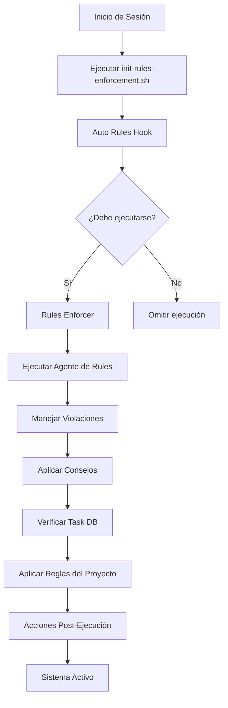

# Sistema de Rules Enforcement Automático

## 🎯 **OBJETIVO**

El Sistema de Rules Enforcement Automático asegura que el **Agente de Rules** se ejecute automáticamente y **obligue a la IA de Cursor** a seguir las reglas del proyecto, mantener el contexto de trabajo y evitar la pérdida de información crítica.

## 🏗️ **ARQUITECTURA**

### **Componentes Principales:**

1. **Rules Enforcer** (`core/rules-enforcer.js`)
   - Ejecuta el agente de rules automáticamente
   - Maneja violaciones y aplica consejos
   - Verifica integridad del Task DB
   - Aplica reglas específicas del proyecto

2. **Auto Rules Hook** (`core/auto-rules-hook.js`)
   - Hook de integración automática
   - Verifica si debe ejecutarse
   - Aplica acciones post-ejecución
   - Maneja errores y recuperación

3. **Script de Inicialización** (`scripts/init-rules-enforcement.sh`)
   - Inicializa el sistema automáticamente
   - Verifica dependencias y estado
   - Crea archivos de estado
   - Proporciona feedback visual

4. **Configuración** (`.claude/rules-enforcement-config.json`)
   - Configuración centralizada
   - Parámetros de ejecución
   - Reglas del proyecto
   - Acciones de enforcement

## 🚀 **FUNCIONAMIENTO**

### **Flujo Automático:**



### **Verificaciones Automáticas:**

1. **Archivos Críticos:**
   - `docs/AGENTS.md`
   - `docs/audits/2025-09-initial-gap.md`
   - `data/taskdb.json`
   - `orchestration/orchestrator.js`

2. **Agentes MCP:**
   - Security Agent
   - Test Agent
   - Documentation Agent
   - Orchestrator

3. **Documentación:**
   - Guía de Agentes
   - Auditoría de Gaps
   - Plan de Reparación

4. **Task DB:**
   - Proyecto de gaps existe
   - Tareas críticas registradas
   - Integridad de datos

## 🔧 **USO**

### **Inicialización Automática:**

```bash
# El sistema se inicializa automáticamente al inicio de cada sesión
./scripts/init-rules-enforcement.sh
```

### **Ejecución Manual:**

```bash
# Ejecutar hook de rules
node core/auto-rules-hook.js

# Ejecutar enforcer directamente
node core/rules-enforcer.js

# Modo continuo (desarrollo)
node core/auto-rules-hook.js --continuous
```

### **Verificación de Estado:**

```bash
# Verificar estado del sistema
cat .reports/rules-enforcement-state.json

# Verificar última ejecución
cat .reports/last-rules-execution.json

# Verificar configuración
cat .claude/rules-enforcement-config.json
```

## 📋 **REGLAS APLICADAS AUTOMÁTICAMENTE**

### **Reglas Fundamentales:**

1. **Registro de Tareas:** Todas las tareas deben registrarse en el Task DB
2. **Cumplimiento de Gaps:** Los gaps críticos deben ser priorizados
3. **Uso de Herramientas MCP:** Utilizar agentes disponibles para tareas específicas
4. **Documentación:** Mantener documentación actualizada
5. **Contexto de Trabajo:** Preservar información crítica entre sesiones

### **Modo de Cumplimiento:**

- **Modo:** STRICT
- **Tono:** ASSERTIVE
- **Dominio:** MCP-PROJECT
- **Auto-fix:** HABILITADO

## 🛠️ **CONFIGURACIÓN**

### **Parámetros Principales:**

```json
{
  "rules_enforcement": {
    "enabled": true,
    "auto_init": true,
    "strict_mode": true,
    "enforcement_interval": 300000,
    "auto_fix": true,
    "task_db_integration": true
  }
}
```

### **Archivos Críticos:**

```json
{
  "critical_files": [
    "docs/AGENTS.md",
    "docs/audits/2025-09-initial-gap.md",
    "data/taskdb.json",
    "orchestration/orchestrator.js"
  ]
}
```

### **Acciones de Enforcement:**

```json
{
  "enforcement_actions": {
    "missing_files": "create",
    "empty_files": "populate",
    "violations": "fix_immediately",
    "advice": "apply_automatically",
    "task_db_issues": "repair"
  }
}
```

## 📊 **MONITOREO**

### **Archivos de Estado:**

1. **`.reports/rules-enforcement-state.json`**
   - Estado actual del sistema
   - Timestamp de inicialización
   - Configuración activa

2. **`.reports/last-rules-execution.json`**
   - Última ejecución del hook
   - Violaciones detectadas
   - Consejos aplicados

3. **`.reports/rules-enforcement.log`**
   - Log detallado de ejecuciones
   - Errores y recuperaciones
   - Historial de enforcement

### **Métricas de Éxito:**

- ✅ **Sistema inicializado** correctamente
- ✅ **Proyecto de gaps** verificado en Task DB
- ✅ **Tareas críticas** registradas (5 tareas)
- ✅ **Agentes MCP** disponibles
- ✅ **Documentación** actualizada
- ✅ **Modo estricto** activado

## 🚨 **RESOLUCIÓN DE PROBLEMAS**

### **Problemas Comunes:**

1. **Agente de Rules no se ejecuta:**
   ```bash
   # Verificar que el archivo existe y es ejecutable
   ls -la agents/rules/agent.js
   chmod +x agents/rules/agent.js
   ```

2. **Task DB no se actualiza:**
   ```bash
   # Verificar permisos y estructura
   ls -la data/taskdb.json
   node -e "console.log(JSON.parse(require('fs').readFileSync('data/taskdb.json', 'utf8')))"
   ```

3. **Violaciones no se corrigen:**
   ```bash
   # Ejecutar enforcement manual
   node core/rules-enforcer.js
   ```

4. **Archivos faltantes:**
   ```bash
   # El sistema crea archivos faltantes automáticamente
   # Verificar en .reports/rules-enforcement.log
   ```

### **Logs de Debug:**

```bash
# Verificar logs de enforcement
tail -f .reports/rules-enforcement.log

# Verificar estado del sistema
cat .reports/rules-enforcement-state.json

# Verificar última ejecución
cat .reports/last-rules-execution.json
```

## 🎯 **BENEFICIOS**

### **Para la IA de Cursor:**

1. **Contexto Preservado:** No se pierde información entre sesiones
2. **Reglas Aplicadas:** Cumplimiento automático de reglas del proyecto
3. **Tareas Registradas:** Todas las tareas se registran automáticamente
4. **Gaps Priorizados:** Los gaps críticos se abordan primero
5. **Herramientas MCP:** Uso automático de agentes disponibles

### **Para el Proyecto:**

1. **Consistencia:** Comportamiento predecible y consistente
2. **Calidad:** Cumplimiento de estándares y mejores prácticas
3. **Eficiencia:** Automatización de tareas repetitivas
4. **Trazabilidad:** Registro completo de actividades
5. **Mantenibilidad:** Sistema auto-reparador y auto-verificador

## 🔮 **FUTURAS MEJORAS**

1. **Integración con CI/CD:** Ejecución automática en pipelines
2. **Métricas Avanzadas:** Dashboard de cumplimiento
3. **Notificaciones:** Alertas en tiempo real
4. **Machine Learning:** Aprendizaje de patrones de uso
5. **API REST:** Interfaz programática para integración

---

**El Sistema de Rules Enforcement Automático asegura que el proyecto MCP funcione de manera consistente, eficiente y siguiendo las mejores prácticas, mientras mantiene el contexto de trabajo y evita la pérdida de información crítica.**
