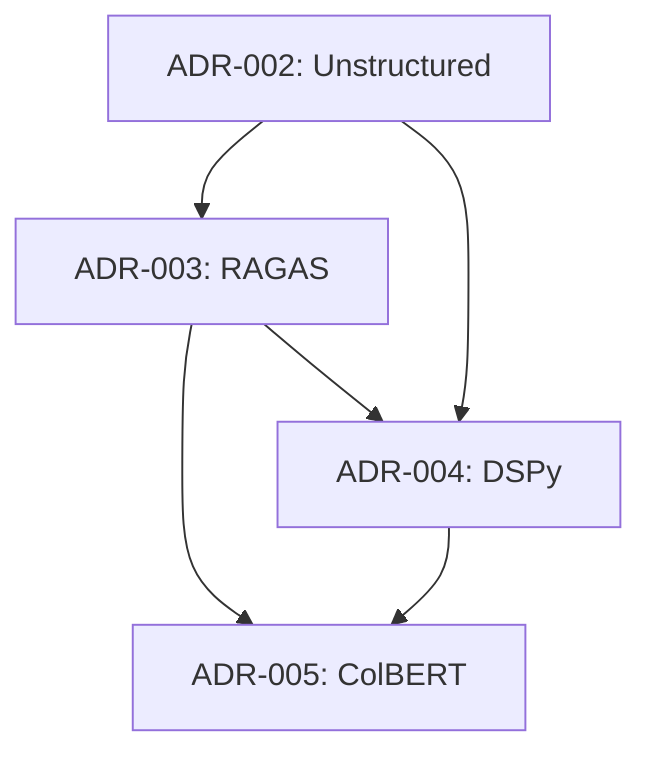

# Architecture Decision Records (ADRs) - Sistema RAG

Este directorio contiene los Architecture Decision Records que documentan las decisiones técnicas críticas del sistema RAG.

## 📋 ADRs del Sistema RAG

### Roadmap de Evolución (ADR-002 a ADR-005)

| ADR | Título | Estado | Dependencias | Impacto |
|-----|--------|--------|--------------|---------|
| [ADR-002](./adr-002.md) | Calidad del Input - Integración de Unstructured | Propuesto | - | Alto |
| [ADR-003](./adr-003.md) | Validación del Output - RAGAS como Gate de Calidad | Propuesto | ADR-002 | Alto |
| [ADR-004](./adr-004.md) | PRPs como Código - Adopción de DSPy | Propuesto | ADR-002, ADR-003 | Medio |
| [ADR-005](./adr-005.md) | Retrieval Crítico - ColBERT para Dominios Sensibles | Propuesto | ADR-002, ADR-003, ADR-004 | Medio |

## 🎯 Objetivo del Roadmap

Transformar el pipeline RAG de funcional a industrial: **auditable, gobernado y confiable**.

### Mitigación de Riesgos Sistémicos
- ✅ **Calidad de Input**: Garbage In, Gospel Out
- ✅ **Erosión de Calidad**: Degradación silenciosa
- ✅ **Deuda Técnica**: Prompts ad-hoc sin versionado
- ✅ **Precisión Insuficiente**: Retrieval limitado en dominios críticos

## 🔄 Dependencias y Secuencia

## 📊 Entregables por ADR

### ADR-002: Calidad del Input
- `cli/rag-ingest-unstructured.ts`
- Corpus re-ingestado con metadatos enriquecidos
- Reducción de errores de parsing en 80%

### ADR-003: Validación del Output
- `eval/ragas_smoke.py`
- TaskDB gate con KPIs automáticos
- Evaluación de 100% de outputs críticos

### ADR-004: PRPs como Código
- `prp/pilot_dspy.py`
- `prp/PRP.lock` (versionado)
- Reproducibilidad 100% garantizada

### ADR-005: Retrieval Crítico
- `retrievers/colbert_adapter.ts`
- Métricas comparativas vs. baseline
- Precisión > 95% en dominios críticos

## 🚀 Estado de Implementación

- ✅ **Roadmap definido**: 4 ADRs secuenciales
- ✅ **Dependencias mapeadas**: Orden de implementación claro
- ✅ **Métricas de éxito**: Criterios cuantificables
- 🔄 **Implementación**: Pendiente de inicio

## 📝 Convenciones

### Estados de ADR
- **Propuesto**: Decisión técnica definida, pendiente de implementación
- **Aceptado**: Decisión aprobada, en implementación
- **Implementado**: Decisión completada y funcionando
- **Deprecado**: Decisión reemplazada por nueva
- **Rechazado**: Decisión descartada

### Formato
- **Contexto**: Problema y requerimientos
- **Opciones**: Alternativas consideradas
- **Decisión**: Opción elegida y justificación
- **Consecuencias**: Impactos positivos/negativos
- **Seguimiento**: Criterios de éxito y revisión

## 🔗 Referencias

- [Roadmap RAG Principal](../../ROADMAP_RAG.md)
- [Documentación TaskDB](../../core/taskdb/README.md)
- [Configuración RAG](../../config/rag.yaml)

---

*Última actualización: $(date)*
*Roadmap RAG - Fase de Planificación Completada*
