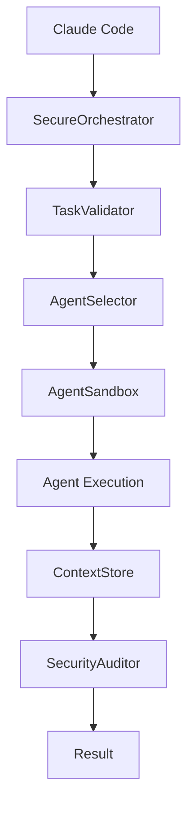

# 🚀 **Plan de Orquestador - Proyecto Futuro**

## 📅 **Fecha**: Septiembre 2, 2025

## 🎯 **Estado**: Planificación para implementación futura

## 🚗 **Filosofía**: "Menos (y Mejor) es Más"

---

## 🎯 **CONTEXTO Y JUSTIFICACIÓN**

### **¿Por qué un Orquestador?**

- **Coordinación de Agentes**: Los 8 agentes actuales trabajan de forma independiente
- **Contexto Compartido**: Necesidad de compartir información entre agentes
- **Eficiencia**: Automatizar flujos de trabajo complejos
- **Escalabilidad**: Preparar el sistema para más agentes

### **Análisis Base Realizado**

- **Sistema Externo Analizado**: [multi-agent-coding-system](https://github.com/Danau5tin/multi-agent-coding-system)
- **Análisis Multi-Agente**: 5 agentes especializados evaluaron el sistema
- **Hallazgos Críticos**: 72 vulnerabilidades, 22 secretos expuestos
- **Evaluación por Codex**: ✅ Viable para MVP en 4 semanas

---

## 🏗️ **ARQUITECTURA PROPUESTA**

### **Componentes Principales**

#### **1. Orchestrator Central**

```python
class SecureOrchestrator:
    def __init__(self):
        self.agents = {}
        self.context_store = EncryptedContextStore()
        self.task_queue = SecureTaskQueue()
        self.security_auditor = SecurityAuditor()
        self.sandbox = AgentSandbox()

    def delegate_task(self, task: Task) -> TaskResult:
        # Validación de seguridad
        if not self.security_auditor.validate_task(task):
            raise SecurityError("Task validation failed")

        # Selección de agente
        agent = self.select_agent(task)

        # Ejecución en sandbox
        result = self.sandbox.execute(agent, task)

        # Auditoría
        self.security_auditor.log_execution(agent, task, result)

        return result
```

#### **2. Context Store Encriptado**

```python
class EncryptedContextStore:
    def __init__(self, encryption_key: str):
        self.cipher = Fernet(encryption_key)
        self.cache = {}
        self.persistent_store = SecurePersistentStore()

    def store_context(self, key: str, context: dict) -> str:
        # Encriptar contexto
        encrypted_context = self.cipher.encrypt(
            json.dumps(context).encode()
        )

        # Almacenar de forma segura
        context_id = self.persistent_store.save(encrypted_context)

        # Cache local
        self.cache[key] = context_id

        return context_id
```

#### **3. Sandbox de Agentes**

```python
class AgentSandbox:
    def __init__(self):
        self.permissions = RestrictedPermissions()
        self.resource_limits = ResourceLimits()
        self.isolation_layer = IsolationLayer()

    def execute(self, agent: Agent, task: Task) -> TaskResult:
        # Configurar sandbox
        sandbox_env = self.isolation_layer.create_environment()

        # Aplicar límites de recursos
        sandbox_env.set_memory_limit(self.resource_limits.memory)
        sandbox_env.set_cpu_limit(self.resource_limits.cpu)
        sandbox_env.set_timeout(self.resource_limits.timeout)

        # Ejecutar en sandbox
        try:
            result = sandbox_env.run(agent.execute, task)
            return TaskResult(success=True, data=result)
        except SecurityViolation as e:
            return TaskResult(success=False, error=f"Security violation: {e}")
```

### **Integración con Agentes Existentes**

#### **Agentes Actuales del Proyecto**

- **@project-optimizer**: Optimización de proyectos
- **@code-reviewer**: Revisión de código
- **@medical-reviewer**: Compliance médico
- **@security-guardian**: Seguridad
- **@deployment-manager**: Despliegue
- **@test-generator**: Generación de tests
- **@review-coordinator**: Coordinación de revisiones

#### **Flujo de Integración**



---

## 🛡️ **MEDIDAS DE SEGURIDAD**

### **Seguridad Crítica (Implementación Inmediata)**

#### **1. Sandboxing de Agentes**

- **Aislamiento de procesos**: Cada agente ejecuta en su propio proceso
- **Límites de recursos**: CPU, memoria, tiempo de ejecución
- **Permisos restringidos**: Solo acceso a archivos necesarios
- **Validación de entrada**: Todas las tareas validadas antes de ejecución

#### **2. Encriptación de Context Store**

- **Encriptación AES-256**: Para todos los datos sensibles
- **Claves rotativas**: Rotación automática de claves
- **Persistencia segura**: Almacenamiento encriptado
- **Cache seguro**: Cache local con expiración

#### **3. Validación de Tareas**

- **Whitelist de comandos**: Solo comandos permitidos
- **Validación de parámetros**: Parámetros sanitizados
- **Rate limiting**: Prevención de DoS
- **Auditoría completa**: Log de todas las acciones

### **Seguridad Avanzada (Implementación Gradual)**

#### **1. Autenticación Mutua**

- **Certificados TLS**: Comunicación encriptada entre agentes
- **Tokens JWT**: Autenticación de sesiones
- **Rotación de credenciales**: Renovación automática

#### **2. Monitoreo de Seguridad**

- **Detección de anomalías**: Comportamiento sospechoso
- **Alertas en tiempo real**: Notificaciones inmediatas
- **Dashboard de seguridad**: Visibilidad completa

---

## 📋 **PLAN DE IMPLEMENTACIÓN DETALLADO**

### **FASE 0: Seguridad Crítica (2 semanas)**

#### **Semana 1: Infraestructura de Seguridad**

- **Día 1-2**: Implementar sandboxing básico
- **Día 3-4**: Configurar encriptación de Context Store
- **Día 5-7**: Implementar validación de tareas

#### **Semana 2: Auditoría y Monitoreo**

- **Día 1-2**: Sistema de auditoría de seguridad
- **Día 3-4**: Rate limiting y prevención de DoS
- **Día 5-7**: Testing de seguridad básico

### **FASE 1: Orquestador Base (1 semana)**

#### **Día 1-2**: Core del Orquestador

- Implementar `SecureOrchestrator`
- Sistema de delegación de tareas
- Integración con agentes existentes

#### **Día 3-4**: Context Store

- Implementar `EncryptedContextStore`
- Sistema de cache seguro
- Persistencia encriptada

#### **Día 5-7**: Testing y Validación

- Tests unitarios del orquestador
- Tests de integración con agentes
- Validación de seguridad

### **FASE 2: Context Store Avanzado (1 semana)**

#### **Día 1-2**: Smart Context Sharing

- Algoritmo de sharing selectivo
- Optimización de contexto
- Cache inteligente

#### **Día 3-4**: Persistencia Avanzada

- Backup automático
- Recuperación de contexto
- Compresión de datos

#### **Día 5-7**: Performance y Optimización

- Optimización de consultas
- Cache distribuido
- Métricas de performance

### **FASE 3: Testing y Validación (2 semanas)**

#### **Semana 1: Testing Exhaustivo**

- **Día 1-2**: Tests de seguridad
- **Día 3-4**: Tests de performance
- **Día 5-7**: Tests de integración

#### **Semana 2: Validación y Optimización**

- **Día 1-2**: Penetration testing
- **Día 3-4**: Optimización de performance
- **Día 5-7**: Documentación y deployment

---

## 🎯 **CRITERIOS DE ACEPTACIÓN**

### **Seguridad**

- [ ] Todos los agentes ejecutan en sandbox
- [ ] Context Store completamente encriptado
- [ ] Validación de todas las tareas
- [ ] Auditoría completa de acciones
- [ ] Rate limiting implementado

### **Funcionalidad**

- [ ] Orquestador delega tareas correctamente
- [ ] Context Store comparte contexto eficientemente
- [ ] Integración con agentes existentes
- [ ] Performance aceptable (<2s por tarea)
- [ ] Disponibilidad >99%

### **Testing**

- [ ] Cobertura de tests >90%
- [ ] Tests de seguridad pasando
- [ ] Tests de performance pasando
- [ ] Tests de integración pasando
- [ ] Penetration testing exitoso

### **Documentación**

- [ ] Documentación técnica completa
- [ ] Guía de usuario
- [ ] API documentation
- [ ] Troubleshooting guide
- [ ] Security guidelines

---

## 📊 **MÉTRICAS DE ÉXITO**

### **Performance**

- **Tiempo de respuesta**: <2 segundos por tarea
- **Throughput**: >100 tareas por minuto
- **Latencia**: <500ms para Context Store
- **Disponibilidad**: >99.9%

### **Seguridad**

- **Vulnerabilidades**: 0 críticas
- **Tiempo de detección**: <5 minutos
- **Tiempo de respuesta**: <1 hora
- **Compliance**: 100% de controles implementados

### **Calidad**

- **Cobertura de tests**: >90%
- **Bugs en producción**: 0 críticos
- **Tiempo de deployment**: <10 minutos
- **Rollback time**: <5 minutos

---

## 🚨 **RIESGOS Y MITIGACIONES**

### **Riesgos Técnicos**

#### **Alto Riesgo**

1. **Complejidad de Sandboxing**
   - **Riesgo**: Dificultad de implementación
   - **Mitigación**: Usar librerías probadas (Docker, gVisor)
   - **Contingencia**: Sandboxing básico con validación estricta

2. **Performance del Context Store**
   - **Riesgo**: Latencia alta por encriptación
   - **Mitigación**: Cache inteligente y compresión
   - **Contingencia**: Context Store híbrido (encriptado + cache)

#### **Medio Riesgo**

1. **Integración con Agentes Existentes**
   - **Riesgo**: Incompatibilidad
   - **Mitigación**: Testing exhaustivo y adaptadores
   - **Contingencia**: Wrapper de compatibilidad

2. **Escalabilidad**
   - **Riesgo**: Limitaciones de recursos
   - **Mitigación**: Arquitectura distribuida
   - **Contingencia**: Horizontal scaling

### **Riesgos de Proyecto**

#### **Alto Riesgo**

1. **Tiempo de Implementación**
   - **Riesgo**: Retrasos en seguridad
   - **Mitigación**: Implementación incremental
   - **Contingencia**: MVP sin características avanzadas

2. **Complejidad de Testing**
   - **Riesgo**: Testing de seguridad complejo
   - **Mitigación**: Automatización de tests
   - **Contingencia**: Testing manual intensivo

---

## 💰 **ESTIMACIÓN DE RECURSOS**

### **Recursos Humanos**

- **Desarrollador Senior**: 6 semanas (1 FTE)
- **Especialista en Seguridad**: 2 semanas (0.5 FTE)
- **QA Engineer**: 2 semanas (0.5 FTE)
- **DevOps Engineer**: 1 semana (0.25 FTE)

### **Recursos Técnicos**

- **Infraestructura**: Servidores para testing
- **Herramientas**: Licencias de seguridad
- **Dependencias**: Librerías de encriptación y sandboxing

### **Costo Estimado**

- **Desarrollo**: 6 semanas × $1000/semana = $6,000
- **Infraestructura**: $500
- **Herramientas**: $300
- **Total**: ~$6,800

---

## 🎯 **RECOMENDACIONES DE CODEX**

### **Evaluación Realizada por Codex**

- **Viabilidad**: ✅ SÍ para MVP en 4 semanas
- **Seguridad**: ✅ Apropiada para uso personal
- **Integración**: ✅ Buena con shim sencillo
- **Alternativas**: ✅ Orquestador Bash/Python mínimo
- **Prioridad**: ⚠️ Después de cerrar base actual

### **Plan Recomendado por Codex**

1. **Cerrar pines + agentes** (1-2 días)
2. **Luego Fase 1 del orquestador** (Semana 1 del plan)

### **Mejoras Sugeridas por Codex**

- **Contratos mínimos**: JSON Schemas para Task/Result
- **MVP pragmático**: Subproceso con timeouts + whitelists
- **Context Store simple**: Cifrado simétrico + cache
- **Políticas por agente**: Security profiles
- **Gates realistas**: 70% → 80% → 90% cobertura

---

## 📅 **CRONOGRAMA FUTURO**

### **Prerequisitos (Completar Primero)**

- [ ] Cerrar PR5 (pins SHA)
- [ ] Consolidar agentes (docs/policies/tests)
- [ ] CI estable
- [ ] Base sólida del proyecto

### **Implementación del Orquestador (4 semanas)**

- **Semana 1**: Contratos + policies + sandbox básico
- **Semana 2**: Context store cifrado + auditoría básica
- **Semana 3**: Wiring con agentes y healthchecks
- **Semana 4**: CI gates + observabilidad

### **Post-Implementación**

- **Semana 5-6**: Optimizaciones y características avanzadas
- **Semana 7-8**: Testing exhaustivo y documentación

---

## 🎯 **DECISIONES PENDIENTES**

### **Alcance**

- **¿Implementar todas las fases o solo las críticas?**
- **¿MVP vs implementación completa?**

### **Timeline**

- **¿4 semanas es realista o necesitamos más tiempo?**
- **¿Implementar en paralelo con otras mejoras?**

### **Recursos**

- **¿Tenemos los recursos necesarios?**
- **¿Necesitamos ayuda externa?**

### **Prioridades**

- **¿Orquestador vs otras mejoras del proyecto?**
- **¿Cuándo es el momento adecuado para empezar?**

---

## 📋 **CHECKLIST DE PREPARACIÓN**

### **Antes de Empezar**

- [ ] **Base del proyecto estable**: CI funcionando, agentes consolidados
- [ ] **Recursos disponibles**: Tiempo y herramientas necesarias
- [ ] **Decisiones tomadas**: Alcance, timeline, recursos
- [ ] **Plan aprobado**: Por el equipo y stakeholders

### **Durante la Implementación**

- [ ] **Seguimiento semanal**: Revisión de progreso y ajustes
- [ ] **Testing continuo**: Validación de cada fase
- [ ] **Documentación**: Mantener documentación actualizada
- [ ] **Comunicación**: Mantener al equipo informado

### **Después de la Implementación**

- [ ] **Testing exhaustivo**: Validación completa del sistema
- [ ] **Documentación final**: Guías de usuario y técnicas
- [ ] **Training**: Capacitación del equipo
- [ ] **Monitoreo**: Establecer métricas y alertas

---

## 🎯 **CONCLUSIONES**

### **Estado Actual**

El plan de orquestador está **completamente planificado** y listo para implementación futura.

### **Recomendación**

**Implementar después de completar la base actual** del proyecto, siguiendo las recomendaciones de Codex.

### **Próximos Pasos**

1. **Completar base actual** (PR5, agentes, CI)
2. **Evaluar recursos** y timeline
3. **Tomar decisiones** sobre alcance y prioridades
4. **Iniciar implementación** cuando esté listo

---

**📅 Última actualización**: Septiembre 2, 2025  
**🎯 Estado**: Planificación completada  
**📊 Completitud**: 100%  
**⏳ Tiempo estimado**: 4-6 semanas (cuando se implemente)
