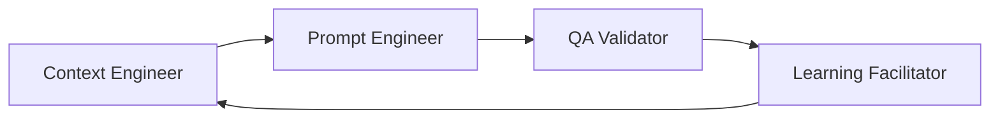
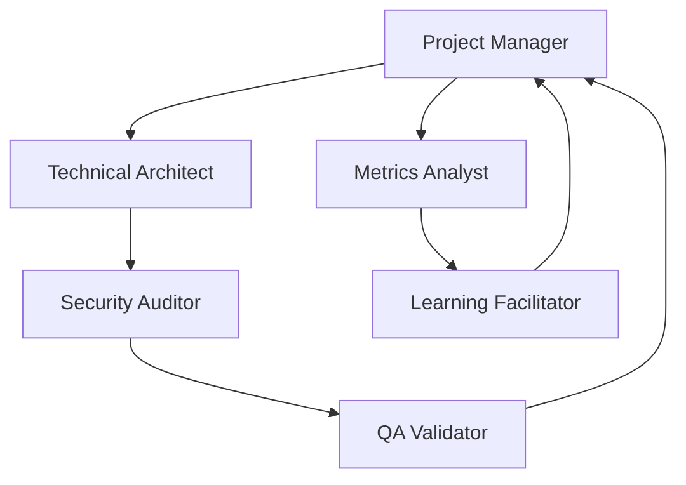
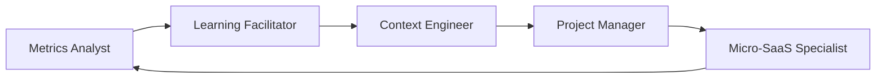

# Matriz de Responsabilidades por Especialidad

## 📊 **Vista Matricial de Especialidades vs. Funcionalidades**

| Funcionalidad | Prompt Eng. | Context Eng. | Project Mgmt | QA/Validation | Security | Metrics | Design | Tech Arch. | Micro-SaaS | Learning |
|---------------|-------------|--------------|--------------|---------------|----------|---------|---------|------------|------------|----------|
| **Comandos Básicos** | 🟢 Lead | 🟡 Support | - | 🟡 Support | - | - | - | 🟡 Support | - | 🟡 Support |
| **Context Design** | 🟡 Support | 🟢 Lead | - | - | - | - | - | - | - | 🟡 Support |
| **Project Planning** | 🟡 Support | 🟡 Support | 🟢 Lead | - | 🟡 Support | 🟡 Support | - | 🟡 Support | 🟡 Support | - |
| **Quality Gates** | 🟡 Support | - | 🟡 Support | 🟢 Lead | 🟡 Support | 🟡 Support | 🟡 Support | 🟡 Support | - | 🟡 Support |
| **Security Audit** | 🟡 Support | 🟡 Support | 🟡 Support | 🟡 Support | 🟢 Lead | 🟡 Support | - | 🟡 Support | - | 🟡 Support |
| **Performance Metrics** | - | - | 🟡 Support | 🟡 Support | 🟡 Support | 🟢 Lead | 🟡 Support | 🟡 Support | 🟡 Support | 🟡 Support |
| **UI/UX Design** | 🟡 Support | 🟡 Support | - | 🟡 Support | - | 🟡 Support | 🟢 Lead | 🟡 Support | - | 🟡 Support |
| **Technical Implementation** | 🟡 Support | 🟡 Support | 🟡 Support | 🟡 Support | 🟡 Support | 🟡 Support | 🟡 Support | 🟢 Lead | 🟡 Support | 🟡 Support |
| **MVP Development** | 🟡 Support | 🟡 Support | 🟡 Support | 🟡 Support | 🟡 Support | 🟡 Support | 🟡 Support | 🟡 Support | 🟢 Lead | 🟡 Support |
| **Retrospectives** | 🟡 Support | 🟡 Support | 🟡 Support | 🟡 Support | 🟡 Support | 🟡 Support | 🟡 Support | 🟡 Support | 🟡 Support | 🟢 Lead |

**Leyenda:**
- 🟢 **Lead**: Responsabilidad principal y toma de decisiones
- 🟡 **Support**: Colaboración y soporte especializado
- **-**: Sin participación directa

---

## 👥 **Equipos de Trabajo por Fase**

### **📋 FASE 1: Foundation (Context + Prompt Engineering)**

#### **Equipo Core:**
- **Context Engineer** (Lead) - Diseño de metodología y templates
- **Prompt Engineer** (Lead) - Optimización de comandos básicos
- **Learning Facilitator** (Support) - Captura de best practices

#### **Deliverables:**
- [ ] Comando `/context-engineering` funcional
- [ ] Agente `@context-engineer` configurado
- [ ] Templates de contexto estructurado
- [ ] Prompts optimizados para comandos básicos
- [ ] Framework de reverse prompting

#### **Success Criteria:**
- Mejora 60%+ en calidad de outputs
- Reducción 50%+ en tiempo de setup
- Contexts reutilizables entre proyectos

---

### **📈 FASE 2: Learning Loop (Retrospective + Improvement)**

#### **Equipo Core:**
- **Learning Facilitator** (Lead) - Framework de retrospectivas
- **Context Engineer** (Support) - Optimización de contexts basada en learnings
- **Metrics Analyst** (Support) - Tracking de mejoras

#### **Deliverables:**
- [ ] Comando `/retrospectiva` implementado
- [ ] Agente `@retrospectiva-facilitator` configurado
- [ ] Sistema de captura de lecciones aprendidas
- [ ] Proceso de optimización de prompts "ganadores"
- [ ] Métricas básicas de learning velocity

#### **Success Criteria:**
- 100% proyectos con retrospectiva
- Mejora continua medible en cada iteración
- Prompts "ganadores" reutilizados >80%

---

### **✅ FASE 3: Quality Assurance (Validation + Testing)**

#### **Equipo Core:**
- **QA Validator** (Lead) - Framework de validación sistemática
- **Technical Architect** (Support) - Integración con testing tools
- **Security Auditor** (Support) - Security testing integration
- **Prompt Engineer** (Support) - Optimización de prompts de validación

#### **Deliverables:**
- [ ] Comando `/validacion-criterios` completo
- [ ] Agente `@qa-validator` configurado
- [ ] Integración Playwright para testing visual
- [ ] Reportes de validación automatizados
- [ ] Quality gates por tipo de proyecto

#### **Success Criteria:**
- Reducción 70% defectos post-entrega
- Automatización 95% validaciones críticas
- Time-to-validation reducido 50%

---

### **🔒 FASE 4: Security & Compliance**

#### **Equipo Core:**
- **Security Auditor** (Lead) - Framework de auditoría
- **QA Validator** (Support) - Integration con security testing
- **Context Engineer** (Support) - Security context templates
- **Technical Architect** (Support) - Security architecture patterns

#### **Deliverables:**
- [ ] Agente `@security-auditor` completo
- [ ] Checklists de compliance automatizados
- [ ] Security scanning integration
- [ ] Incident response procedures
- [ ] HIPAA/GDPR compliance frameworks

#### **Success Criteria:**
- 0 incidentes críticos de seguridad
- 100% compliance en proyectos regulados
- Detección automática de vulnerabilidades

---

### **📊 FASE 5: Metrics & Analytics**

#### **Equipo Core:**
- **Metrics Analyst** (Lead) - Dashboard y analytics
- **Learning Facilitator** (Support) - Learning metrics integration
- **QA Validator** (Support) - Quality metrics tracking
- **Project Manager** (Support) - Productivity metrics

#### **Deliverables:**
- [ ] Agente `@metrics-analyst` configurado
- [ ] Dashboard de métricas core
- [ ] Sistema de alertas automáticas
- [ ] Reportes de tendencias
- [ ] Predictive analytics básico

#### **Success Criteria:**
- Visibilidad 100% métricas críticas
- Insights accionables >90%
- Decision support efectivo

---

### **📋 FASE 6: Advanced Project Management**

#### **Equipo Core:**
- **Project Manager** (Lead) - Planificación avanzada
- **Context Engineer** (Support) - Context para planning
- **Metrics Analyst** (Support) - Planning metrics
- **Technical Architect** (Support) - Technical planning integration

#### **Deliverables:**
- [ ] Comando `/plan-con-razonamiento` completo
- [ ] Comando `/pre-mortem` implementado
- [ ] Agente `@plan-strategist` configurado
- [ ] Agente `@gantt-generator` funcional
- [ ] Risk management framework

#### **Success Criteria:**
- Precisión estimaciones +30%
- Detección temprana riesgos 90%+
- Cronogramas auto-adaptativos

---

### **🚀 FASE 7: Micro-SaaS Acceleration**

#### **Equipo Core:**
- **Micro-SaaS Specialist** (Lead) - Factory methodology
- **Project Manager** (Support) - MVP planning integration
- **Technical Architect** (Support) - Rapid development patterns
- **Metrics Analyst** (Support) - Portfolio analytics

#### **Deliverables:**
- [ ] Comando `/mvp-sprint` completo
- [ ] Comando `/portfolio-manager` funcional
- [ ] Factory approach templates
- [ ] Monetization strategies
- [ ] Portfolio optimization tools

#### **Success Criteria:**
- Time-to-MVP <48 horas
- Portfolio ROI optimization
- Systematic revenue generation

---

## 🔄 **Flujos de Colaboración Cross-Functional**

### **Daily Operations:**

### **Weekly Planning:**

### **Monthly Strategy:**

---

## 📋 **Roles y Responsabilidades Detalladas**

### **🧠 Context Engineer**
**Responsabilidades Principales:**
- Diseñar frameworks de context engineering
- Implementar reverse prompting methodology
- Mantener knowledge bases adaptativos
- Optimizar contexts basado en feedback

**KPIs:**
- Context reuse rate: >80%
- Context setup time: <5 min
- Output quality improvement: >60%

**Dependencies:**
- Input de Learning Facilitator para optimizaciones
- Feedback de todos los roles para context refinement

---

### **✍️ Prompt Engineer**
**Responsabilidades Principales:**
- Diseñar y optimizar prompts para comandos
- Crear templates reutilizables
- Implementar few-shot examples
- Mantener biblioteca de anti-patterns

**KPIs:**
- First-iteration success rate: >80%
- Prompt reuse across projects: >70%
- User satisfaction with commands: >4.5/5

**Dependencies:**
- Context Engineer para integration
- QA Validator para prompt validation

---

### **📊 Project Manager**
**Responsabilidades Principales:**
- Planificación estratégica con razonamiento
- Risk management y pre-mortem analysis
- Resource allocation optimization
- Timeline y dependency management

**KPIs:**
- Estimation accuracy: +30% vs baseline
- Risk detection rate: >90%
- Project delivery on-time: >85%

**Dependencies:**
- Metrics Analyst para data-driven decisions
- Technical Architect para feasibility

---

### **✅ QA Validator**
**Responsabilidades Principales:**
- Validación sistemática contra criterios
- Automated testing implementation
- Quality gate enforcement
- Gap analysis y remediation planning

**KPIs:**
- Defect reduction: 70% vs baseline
- Automated coverage: >95%
- Validation time: <30min per project

**Dependencies:**
- Technical Architect para testing integration
- Security Auditor para security validation

---

### **🔒 Security Auditor**
**Responsabilidades Principales:**
- Security audit framework
- Compliance validation (HIPAA, GDPR)
- Vulnerability assessment
- Incident response planning

**KPIs:**
- Critical incidents: 0
- Compliance rate: 100%
- Vulnerability detection: automated

**Dependencies:**
- QA Validator para integration
- Technical Architect para security architecture

---

### **📈 Metrics Analyst**
**Responsabilidades Principales:**
- Performance metrics tracking
- Trend analysis y insights
- Dashboard maintenance
- Predictive analytics

**KPIs:**
- Metrics coverage: 100% critical areas
- Actionable insights: >90%
- Prediction accuracy: >75%

**Dependencies:**
- Todas las especialidades para data collection
- Learning Facilitator para improvement metrics

---

### **🎨 Design Specialist**
**Responsabilidades Principales:**
- Anti-generic design methodology
- Visual validation con Playwright
- Uniqueness scoring
- Accessibility compliance creativa

**KPIs:**
- Uniqueness score: ≥75% vs competencia
- WCAG compliance: 100%
- Performance maintenance: targets met

**Dependencies:**
- Context Engineer para design contexts
- QA Validator para visual testing

---

### **🏗️ Technical Architect**
**Responsabilidades Principales:**
- Architecture patterns y best practices
- Tool integration (MCP, Playwright)
- Performance optimization
- Infrastructure setup

**KPIs:**
- Performance targets: achieved
- Integration reliability: >99%
- Developer experience: >4.5/5

**Dependencies:**
- Security Auditor para security patterns
- QA Validator para testing architecture

---

### **🚀 Micro-SaaS Specialist**
**Responsabilidades Principales:**
- Factory approach methodology
- MVP development frameworks
- Portfolio management strategies
- Monetization optimization

**KPIs:**
- Time-to-MVP: <48h
- Portfolio ROI: >300% annual
- Cross-project synergies: identified y implemented

**Dependencies:**
- Project Manager para MVP planning
- Technical Architect para rapid development

---

### **🎓 Learning Facilitator**
**Responsabilidades Principales:**
- Retrospective facilitation
- Lessons learned capture
- Continuous improvement process
- Knowledge transfer optimization

**KPIs:**
- Retrospective completion: 100%
- Learning implementation: >80%
- Knowledge transfer effectiveness: measured

**Dependencies:**
- Metrics Analyst para learning metrics
- Todas las especialidades para input y feedback

---

## 🎯 **Success Metrics Transversales**

### **Productivity Metrics:**
- Overall development speed: +50% vs baseline
- Context setup time: <5 minutes
- Quality gates completion: <30 minutes
- Project initialization: <15 minutes

### **Quality Metrics:**
- First-iteration success: >80%
- Post-delivery defects: -70% vs baseline
- Compliance rate: 100% en proyectos críticos
- User satisfaction: >4.5/5

### **Learning Metrics:**
- Improvement velocity: measurable cada sprint
- Best practice adoption: >90%
- Cross-project knowledge transfer: >75%
- Innovation implementation: >50% ideas evaluated

### **Business Metrics:**
- ROI per project: >200%
- Time-to-market: -60% vs traditional
- Portfolio optimization: measurable improvements
- Revenue generation: systematic y predictable

Esta organización asegura claridad en responsabilidades, colaboración efectiva y success measurable en cada especialidad.
