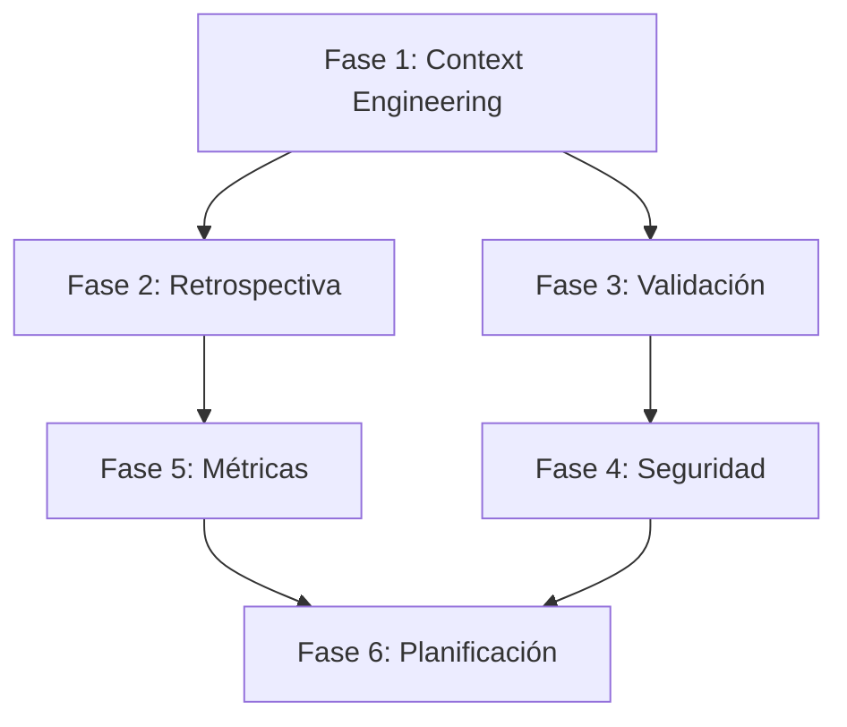

# Roadmap de Implementación: Mejoras al Claude Project Init Kit

## 🎯 Visión General

Implementar las mejoras identificadas en la guía de gestión de proyectos con IA, siguiendo nuestra metodología de "menos (y mejor) es más" con fases claras y gates de validación.

## 📋 Estructura del Roadmap

### **Fase 1: Context Engineering Foundation** 
*Duración: 1-2 semanas | Prioridad: CRÍTICA*

#### Objetivos
- Establecer base sólida para context engineering
- Mejorar calidad de outputs mediante contexto explícito
- Implementar reverse prompting sistemático

#### Entregables
- [ ] **Comando `/context-engineering`** completo y probado
- [ ] **Agente `@context-engineer`** configurado
- [ ] **Plantilla `context-engineering-template.md`** en `/templates`
- [ ] **Documentación actualizada** en GUIA_COMPLETA.md
- [ ] **Tests de integración** para el nuevo comando

#### Criterios de Aceptación
- ✅ Comando genera contexto estructurado siguiendo plantilla
- ✅ Reverse prompting funciona automáticamente 
- ✅ Ejemplos ✅/❌ se incluyen consistentemente
- ✅ Validación de contexto antes de ejecución
- ✅ Integración perfecta con flujo existente

#### Riesgos y Mitigaciones
- **Riesgo**: Complejidad excesiva en contexto → **Mitigación**: Templates simples y ejemplos claros
- **Riesgo**: Resistencia al cambio de workflow → **Mitigación**: Hacer opcional inicialmente

---

### **Fase 2: Retrospectiva y Aprendizaje Continuo**
*Duración: 1-2 semanas | Prioridad: ALTA*

#### Objetivos
- Implementar ciclos de mejora continua
- Capturar lecciones aprendidas sistemáticamente
- Optimizar prompts y contextos basado en evidencia

#### Entregables
- [ ] **Comando `/retrospectiva`** con framework 4Ls
- [ ] **Agente `@retrospectiva-facilitator`** especializado
- [ ] **Sistema de captura** de prompts "ganadores"
- [ ] **Plantilla retrospectiva** estandarizada
- [ ] **Integración con hooks** para ejecución automática

#### Criterios de Aceptación
- ✅ Retrospectiva genera insights accionables
- ✅ Lecciones aprendidas se archivan automáticamente
- ✅ Prompts exitosos se guardan en templates/
- ✅ Métricas básicas se capturan y analizan
- ✅ Plan de mejora específico con deadlines

#### Valor Esperado
- +40% eficiencia en iteraciones futuras
- Reducción de errores repetitivos
- Optimización continua de workflows

---

### **Fase 3: Validación Sistemática**
*Duración: 2-3 semanas | Prioridad: ALTA*

#### Objetivos
- Implementar validación automatizada contra criterios
- Mejorar calidad y consistencia de entregables
- Reducir defectos y re-trabajo

#### Entregables
- [ ] **Comando `/validacion-criterios`** completo
- [ ] **Agente `@qa-validator`** con framework de testing
- [ ] **Integración Playwright** para validación visual
- [ ] **Reportes de validación** estandarizados
- [ ] **Sistema de remediation** automatizado

#### Criterios de Aceptación
- ✅ Validación cubre funcional, calidad, seguridad, usabilidad
- ✅ Tests automatizados se ejecutan sistemáticamente
- ✅ Gaps se identifican con soluciones específicas
- ✅ Reportes ejecutivos claros y accionables
- ✅ Plan de remediation priorizado automáticamente

#### Integración con Fases Anteriores
- Context engineer → QA validator (contexto optimizado para validación)
- Retrospectiva → QA validator (mejoras basadas en defectos históricos)

---

### **Fase 4: Seguridad y Compliance**
*Duración: 2-3 semanas | Prioridad: MEDIA-ALTA*

#### Objetivos
- Implementar auditoría de seguridad automática
- Asegurar compliance con mejores prácticas
- Minimizar exposición de datos sensibles

#### Entregables
- [ ] **Agente `@security-auditor`** especializado
- [ ] **Checklists de seguridad** automatizados
- [ ] **Scanning automático** de vulnerabilidades
- [ ] **Reportes de compliance** detallados
- [ ] **Plan de remediation** de seguridad

#### Criterios de Aceptación
- ✅ Auditoría cubre data protection, access control, code security
- ✅ Vulnerabilidades se detectan automáticamente
- ✅ Compliance se valida sistemáticamente
- ✅ Remediation es específica y priorizada
- ✅ Zero incidentes de seguridad en producción

---

### **Fase 5: Métricas y Analytics**
*Duración: 1-2 semanas | Prioridad: MEDIA*

#### Objetivos
- Implementar dashboard de métricas clave
- Proporcionar insights basados en datos
- Optimizar performance basado en evidencia

#### Entregables
- [ ] **Agente `@metrics-analyst`** configurado
- [ ] **Dashboard de métricas** core (plazo, calidad, productividad)
- [ ] **Sistema de alertas** automáticas
- [ ] **Reportes de tendencias** y benchmarking
- [ ] **Recomendaciones** basadas en datos

#### Métricas Core (De la Guía)
- **Plazo**: Lead time por tarea, % tareas a tiempo
- **Calidad**: Defectos post-entrega, % re-trabajo
- **Productividad**: Tareas completadas/iteración
- **Seguridad**: Incidentes (objetivo: 0)
- **Trazabilidad**: % entregas con contexto archivado

---

### **Fase 6: Planificación Avanzada**
*Duración: 2-3 semanas | Prioridad: MEDIA-BAJA*

#### Objetivos
- Implementar planificación estratégica con razonamiento
- Mejorar gestión de dependencias y riesgos
- Optimizar secuenciación de tareas

#### Entregables
- [ ] **Comando `/plan-con-razonamiento`** completo
- [ ] **Agente `@plan-strategist`** especializado
- [ ] **Templates de planificación** estructurados
- [ ] **Análisis de dependencias** automatizado
- [ ] **Gestión de riesgos** integrada

#### Criterios de Aceptación
- ✅ Reverse prompting obligatorio antes de planificar
- ✅ WBS detallado con estimaciones y dependencias
- ✅ Razonamiento explícito para todas las decisiones
- ✅ Análisis de riesgos con mitigaciones específicas
- ✅ Criterios de validación por fase

---

## 🔄 Dependencias Entre Fases

### Justificación de Dependencias
- **Context Engineering es foundation** para todas las demás fases
- **Retrospectiva** necesita context engineering para capturar prompts optimizados
- **Validación** puede comenzar en paralelo pero se beneficia de contexto mejorado
- **Métricas** necesita datos de retrospectiva para análisis de tendencias
- **Seguridad** se integra mejor después de validación sistemática
- **Planificación avanzada** se beneficia de todos los insights previos

## 📊 Métricas de Éxito del Roadmap

### Por Fase
| Fase | Métrica Principal | Objetivo | Forma de Medición |
|------|------------------|----------|-------------------|
| 1 | Calidad de contexto | +60% outputs aprobados primera vez | A/B testing contexto |
| 2 | Mejora continua | 100% retrospectivas ejecutadas | Tracking automático |
| 3 | Calidad entregables | -50% defectos post-entrega | Comparación histórica |
| 4 | Seguridad | 0 incidentes críticos | Monitoring continuo |
| 5 | Visibilidad | 100% métricas capturadas | Dashboard coverage |
| 6 | Eficiencia planificación | +30% precisión estimaciones | Análisis variance |

### Métricas Globales
- **ROI del Roadmap**: Tiempo ahorrado vs. tiempo invertido en implementación
- **Adopción**: % usuarios utilizando nuevas funcionalidades
- **Satisfacción**: Survey post-implementación (escala 1-10)
- **Calidad Global**: Reducción defectos + mejora velocidad

## 🚨 Riesgos del Roadmap y Mitigaciones

### Riesgos Técnicos
| Riesgo | Probabilidad | Impacto | Mitigación |
|--------|--------------|---------|------------|
| Complejidad excesiva | Media | Alto | Implementación incremental, MVP first |
| Incompatibilidad con flujo actual | Baja | Alto | Backward compatibility mandatorio |
| Performance degradation | Baja | Medio | Benchmarking en cada fase |

### Riesgos de Adopción
| Riesgo | Probabilidad | Impacto | Mitigación |
|--------|--------------|---------|------------|
| Resistencia al cambio | Media | Alto | Training y documentación extensiva |
| Curva de aprendizaje empinada | Alta | Medio | Ejemplos claros y tutoriales |
| Abandono de nuevas features | Media | Medio | Métricas de adopción y feedback loops |

## 🎯 Gates de Validación

### Gate 1 (Post-Fase 1): Context Engineering Validation
- [ ] A/B test muestra +50% mejora en calidad outputs
- [ ] 90% usuarios pueden usar comando sin documentación
- [ ] Zero regresiones en funcionalidad existente
- [ ] Feedback positivo en user testing

### Gate 2 (Post-Fase 2): Learning Loop Validation  
- [ ] 100% retrospectivas generan insights accionables
- [ ] 80% prompts "ganadores" son reutilizados
- [ ] Evidencia de mejora continua medible
- [ ] Documentación automática funciona correctamente

### Gate 3 (Post-Fase 3): Quality Assurance Validation
- [ ] 70% reducción en defectos post-entrega
- [ ] Validación automática cubre 95% casos críticos
- [ ] Reportes de validación son accionables
- [ ] Integración con Playwright es estable

### Gate Final: Roadmap Success Validation
- [ ] Todas las métricas de éxito se cumplen
- [ ] Zero regresiones en funcionalidad existente
- [ ] Documentación completa y actualizada
- [ ] Plan de mantenimiento y evolución definido

## 🚀 Plan de Comunicación

### Stakeholders
- **Usuario principal (Felipe)**: Updates semanales, demos de funcionalidad
- **Equipo técnico**: Daily standups durante implementación
- **Community**: Blog posts y documentation updates

### Hitos de Comunicación
- **Kick-off**: Presentación del roadmap completo
- **Post-Fase 1**: Demo de context engineering
- **Mid-point**: Retrospectiva del roadmap (post-Fase 3)
- **Launch**: Presentación de todas las mejoras implementadas
- **Post-Launch**: Retrospectiva y planning de siguiente iteración

## 💡 Recomendación Final

**COMENZAR INMEDIATAMENTE** con Fase 1 (Context Engineering) porque:

1. **Mayor impacto**: Foundation para todas las demás mejoras
2. **Riesgo bajo**: No rompe funcionalidad existente
3. **ROI inmediato**: Mejora quality of outputs desde día 1
4. **Alineación perfecta**: Con metodología Toyota y guía de gestión IA

**Success criteria para autorizar continuación**: Gate 1 validation positiva + feedback usuario satisfactorio.

El roadmap está diseñado para **value incremental** en cada fase, permitiendo abortar o pivotear si alguna fase no cumple expectativas, mientras se mantiene value acumulado de fases completadas.
